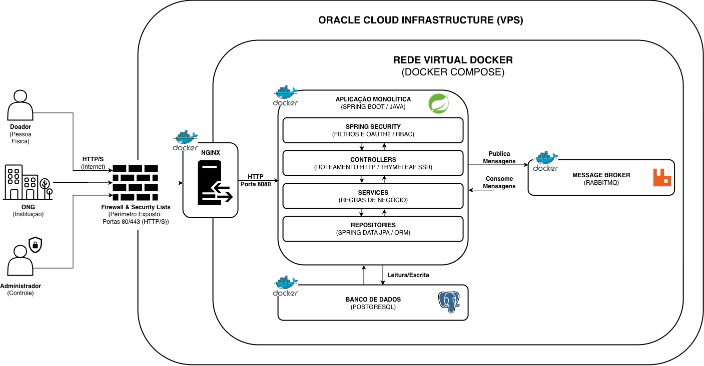

# Arquitetura do Sistema ReSource

## Estilo Arquitetural

O sistema adota o estilo **Monólito Modular** baseado no padrão **MVC (Model-View-Controller)** clássico com **Server-Side Rendering (SSR)** utilizando **Thymeleaf**. 

A solução é empacotada e orquestrada via **Docker Compose**, executando dentro de uma Virtual Private Server (VPS) na **Oracle Cloud Infrastructure (OCI)**.

---

## Diagrama de Arquitetura

> **Nota:** O arquivo fonte editável do diagrama está disponível em [`ReSource-Arquitetura.drawio`](ReSource-Arquitetura.drawio).

---

## Atores do Sistema

| Ator | Tipo | Papel no Sistema |
|---|---|---|
| **Doador** | Pessoa Física | Consulta ONGs, projetos e realiza doações/apoio. |
| **ONG** | Instituição | Cadastra a instituição, submete documentos sensíveis e gerencia demandas. |
| **Administrador** | Controle interno | Valida cadastros de ONGs, audita documentos e gerencia a plataforma. |

---

## Detalhamento dos Componentes

### Borda e Segurança Perimetral
* **Firewall & Security Lists:** Controla o tráfego de entrada na VPS, expondo apenas as portas seguras `80` (HTTP) e `443` (HTTPS).
* **Nginx (Reverse Proxy):** Atua como ponto de terminação TLS/SSL e roteia o tráfego externo para a porta interna `8080` da aplicação monolítica.

### Aplicação Monolítica (Spring Boot / Java)
A aplicação está organizada em camadas bem delimitadas:
* **Spring Security:** Intercepta as requisições para autenticação e autorização via filtros, suporte a OAuth2 e controle de acesso baseado em papéis (RBAC).
* **Controllers (Roteamento HTTP / Thymeleaf SSR):** Controladores MVC que recebem as requisições do usuário, acionam as regras de negócio e renderizam as páginas HTML via Thymeleaf.
* **Services (Regras de Negócio):** Concentra a lógica de negócio, orquestração de transações e comunicação com serviços externos e mensageria.
* **Repositories (Spring Data JPA / ORM):** Camada de persistência que gerencia as entidades e operações de banco de dados via Hibernate/JPA.

### Infraestrutura e Serviços de Apoio (Rede Virtual Docker)
* **Message Broker (RabbitMQ):** Responsável pela mensageria assíncrona (envio de e-mails, processamento de documentos em background e notificações).
* **Banco de Dados (PostgreSQL):** Armazenamento relacional principal para persistência de dados transacionais, entidades e auditoria.

---

## Ambiente de Hospedagem e Execução

* **Provedor:** Oracle Cloud Infrastructure (OCI - VPS).
* **Orquestração Local:** Docker & Docker Compose em rede virtual isolada para comunicação interna entre Nginx, Aplicação, PostgreSQL e RabbitMQ.

---

## Histórico de Alterações

| Versão | Data       | Autor        | Descrição                                            |
|--------|------------|--------------|------------------------------------------------------|
| 1.0    | 2026-09-05 | Hiel Saraiva | Criação inicial do documento de arquitetura.         |
| 1.1    | 2026-09-13 | Hiel Saraiva | Inclusão do diagrama oficial e detalhamento das camadas e infraestrutura. |