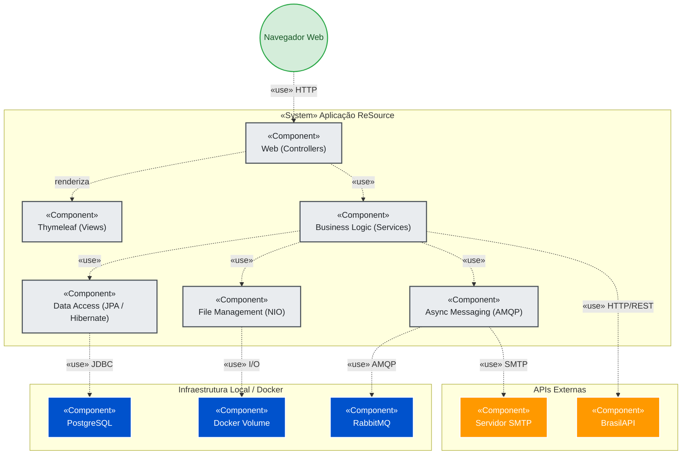

# Arquitetura do Sistema

## Estilo Arquitetural

O projeto adota o estilo de um Monólito Modular baseado no padrão MVC (Model-View-Controller) clássico, com Server-Side Rendering (SSR).

## Diagrama de Componentes

## Histórico de Alterações

| Versão | Data       | Autor                 | Descrição            |
|--------|------------|-----------------------|----------------------|
| 1.0    | 2026-09-05 | Hiel Saraiva          | Criação do documento |